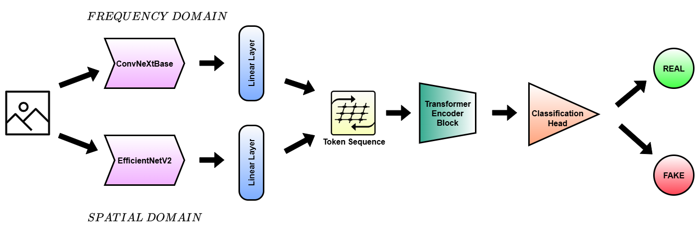
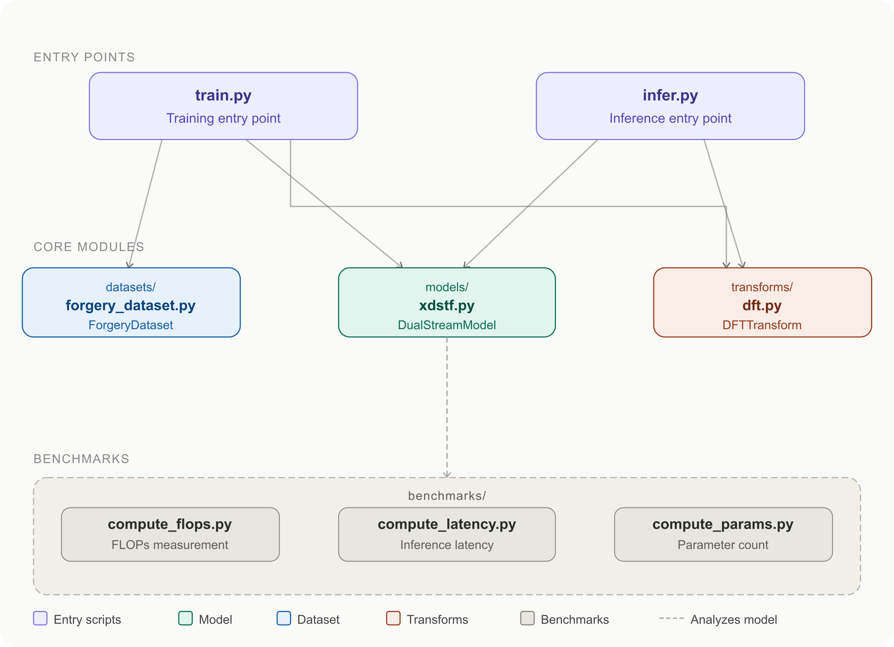

# X-DSTF: Explainable Dual-Stream Transformer Fusion Framework for AI-Generated Image Classification

We propose the **X-DSTF** framework, a dual-stream transformer-based architecture for synthetic media forensics. It fuses a spatial stream (EfficientNet-V2-S) and a frequency stream (ConvNeXt-Base + DFT) through a Transformer encoder for robust deepfake detection.

<div align="center">
  
</div>

<div align="center">
  
  <p><em>Supplementary Figure: Repository code structure and data flow.</em></p>
</div>

---

## Repository Structure

```
X-DSTF/
├── assets/
│   └── sample.jpg              # Sample image for quick inference test
├── benchmarks/
│   ├── compute_flops.py        # FLOPs measurement
│   ├── compute_latency.py      # Inference latency benchmarking
│   └── compute_params.py       # Parameter count & memory report
├── datasets/
│   └── forgery_dataset.py      # Dataset loader (ForgeryDataset class)
├── figures/
│   ├── pipeline.png            # Model architecture figure
│   └── code_structure.png      # Supplementary: repo code structure diagram
├── models/
│   └── xdstf.py               # DualStreamModel definition
├── transforms/
│   └── dft.py                 # Spatial & DFT frequency transforms
├── infer.py                   # Inference script (single image or folder)
├── train.py                   # Training script
├── requirements.txt
└── README.md
```

---

## Environment Setup

**Requirements:** Python 3.9+, PyTorch 2.8.0, CUDA 12.6

```bash
# 1. Clone the repository
git clone https://github.com/WijdanHaider/X-DSTF.git
cd X-DSTF
# 2. Install dependencies
pip install -r requirements.txt
```

---

## Data Preparation

Organize your dataset under `data/` with the following structure:

```
data/
├── train/
│   ├── real/      # Real images
│   └── fake/      # AI-generated / forged images
└── val/
    ├── real/
    └── fake/
```

---

## Training

All training hyperparameters match the experimental protocol reported in the paper (Table 15):

| Parameter        | Value                  |
|-----------------|------------------------|
| Optimizer        | AdamW                  |
| Learning rate    | 1e-4                   |
| Weight decay     | 1e-4                   |
| Batch size       | 16                     |
| Loss             | Binary Cross-Entropy   |
| LR Scheduler     | ReduceLROnPlateau (factor=0.2, patience=3) |
| Early stopping   | patience=5             |
| Max epochs       | 25                     |

**Command to start training the model:**
```bash
python train.py --data_dir data/ --batch_size 16 --lr 1e-4 --augmentation none
```
**Available augmentation strategies:** none, light, mild, extensive

**Resume from checkpoint:**
```bash
python train.py \
  --data_dir data/ \
  --batch_size 16 \
  --lr 1e-4 \
  --augmentation none \
  --resume <path to checkpoint>
```

Checkpoints are saved to `checkpoints/best_model.pth.tar` (best validation loss) and `checkpoints/latest_checkpoint.pth.tar` (latest epoch).

---

## Inference

**Single image:**

```bash
python infer.py \
  --checkpoint <path to checkpoint>\
  --input <path to input image>
```

**Batch inference on a folder:**

```bash
python infer.py \
  --checkpoint <path to checkpoint>\
  --input <path to input folder> \
  --output <path to save results> \
  --batch_size 16
```

**Adjust the decision threshold** (default: 0.5):

```bash
python infer.py \
  --checkpoint <path to checkpoint> \
  --input <path to input folder> \
  --threshold 0.6
```

The script prints per-image predictions (REAL / FAKE) with confidence scores and optionally saves a `.csv` file.

---

## Efficiency Benchmarking

Each benchmarking script is independent and can be run separately:

```bash
# FLOPs
python benchmarks/compute_flops.py

# Parameter count and memory usage
python benchmarks/compute_params.py

# Inference latency
python benchmarks/compute_latency.py
```

**Hardware used in paper benchmarking experiments:**

| Experiment | Hardware |
|------------|----------|
| Training   | 2× NVIDIA T4 (15 GB VRAM), Intel Xeon (2-core, 2.2 GHz), 32 GB RAM |
| Inference  | 1× NVIDIA L4 (22.16 GB VRAM), Intel Xeon (6-core, 2.2 GHz), 53 GB RAM |

---
